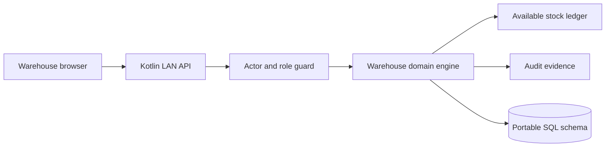
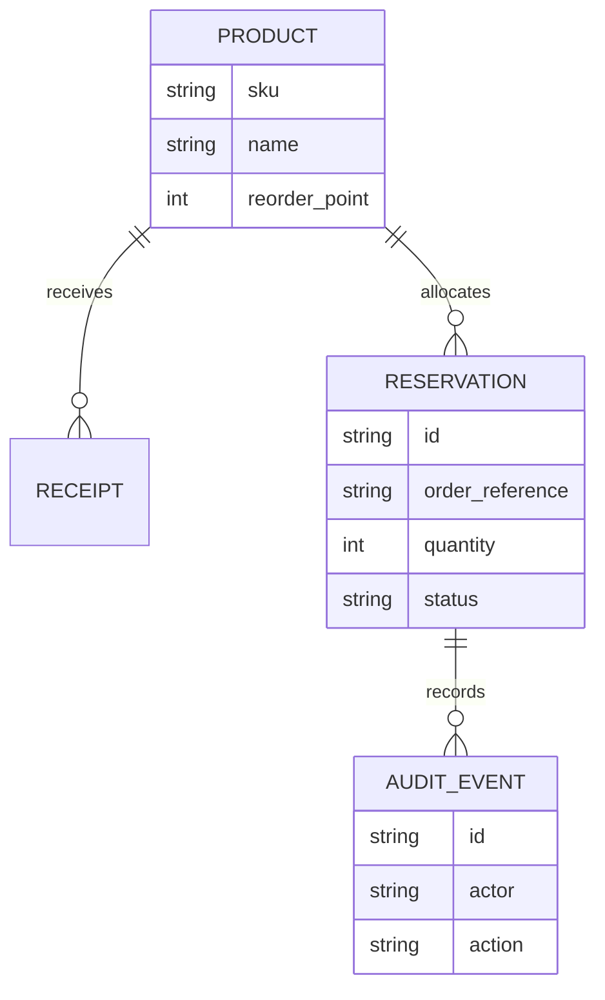
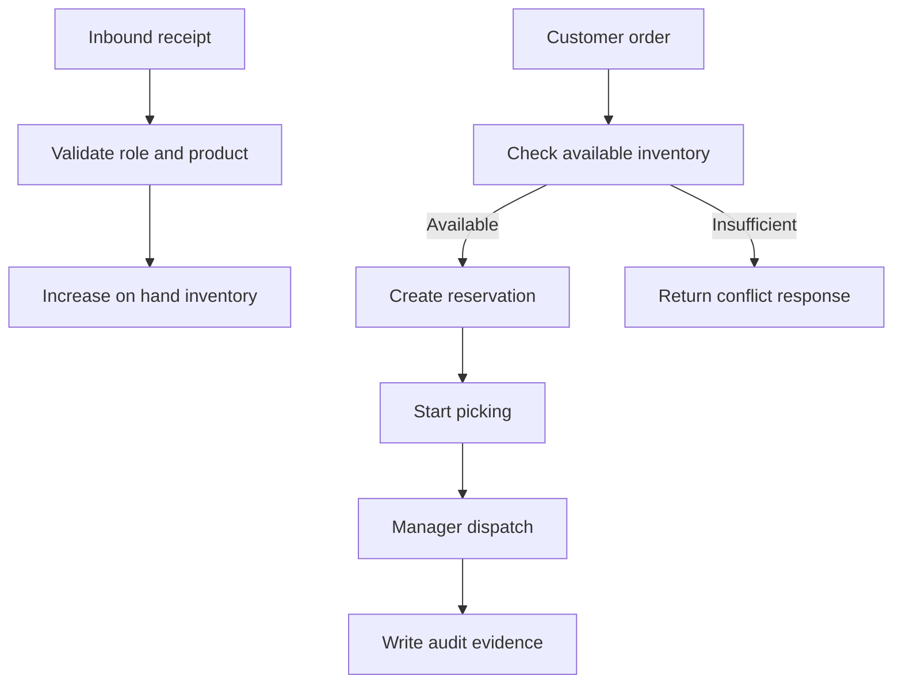
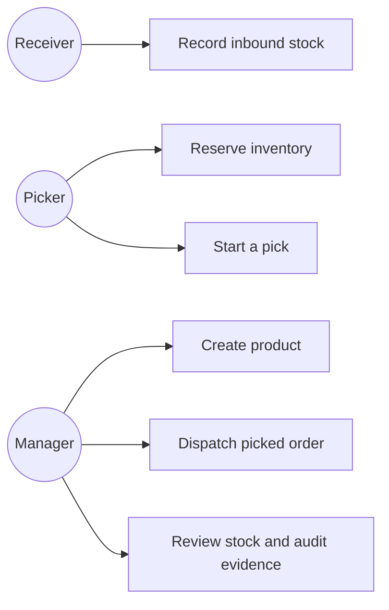
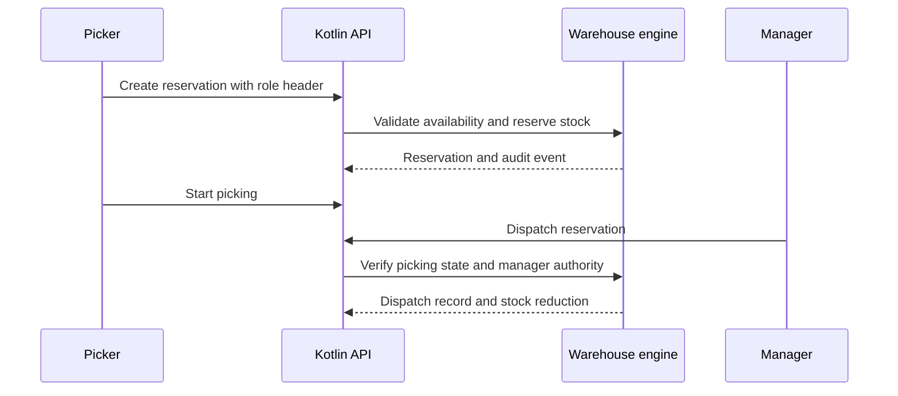

# Kotlin Warehouse Inventory and Fulfillment Control Platform

## The Problem

Warehouse teams often update inbound receipts, stock allocation, picking, and dispatch status in disconnected tools. That creates a practical risk: sales orders can reserve the same inventory twice, dispatch can occur before a pick is confirmed, and managers cannot reconstruct who altered stock availability when a customer shipment becomes disputed.

## The Solution

This Kotlin platform keeps product master data, receipts, available inventory, order reservations, fulfillment transitions, and audit evidence within one constrained operational model. The system accepts inventory only from receiving and management roles, blocks reservations that exceed available stock, requires a picker or manager to start fulfillment, and permits dispatch only when a manager completes a reservation that is already in the picking state. Each workflow writes a time stamped audit event for operational review.

## Live Demo & Tech Stack

Run the service locally and open `http://localhost:10500` to use the browser operations board. The dashboard accepts an operator name and role header for development and integration testing. A production deployment should connect those identity values to an upstream session or gateway authorization layer.

| Concern | Implementation |
|---|---|
| Domain and workflows | Kotlin JVM 21, typed product, receipt, reservation, stock, and audit models |
| Authorization | Receiver, picker, and manager roles enforced in domain commands and HTTP API routes |
| Operations interface | Dependency free HTTP server and responsive browser dashboard |
| Inventory safety | Available stock calculation, over reservation conflict prevention, and guarded dispatch state transition |
| Delivery controls | Gradle test suite, Docker image, Docker Compose, GitHub Actions CI, and portable SQL schema |

## Local Setup & Run Instructions

```bash
git clone https://github.com/kholipha-ahmmad-al-amin/kotlin-warehouse-inventory-fulfillment-control-platform.git
cd kotlin-warehouse-inventory-fulfillment-control-platform
gradle --no-daemon test
PORT=10500 gradle --no-daemon run
```

The server binds to `0.0.0.0` and exposes `GET /health`, `GET /api/snapshot`, `GET /api/audit`, `POST /api/products`, `POST /api/receipts`, `POST /api/reservations`, `POST /api/reservations/{id}/pick`, `POST /api/reservations/{id}/release`, and `POST /api/reservations/{id}/dispatch`. Protected routes require `X-Actor` and `X-Role` headers. The valid roles are `RECEIVER`, `PICKER`, and `MANAGER`.

## System Documentation (Mermaid.js)

### Architecture



### ERD



### Data Flow



### Use Case



### Sequence



## Owner

Created and maintained by Kholipha Ahmmad Al-Amin.

Software Engineer and AI Specialist

Founder and CEO of EquiSaaS BD

Principal Consultant at AR IT Consultancy

Full Stack Developer and SaaS Product Builder

### Official links

Portfolio: https://kholipha-ahmmad-al-amin.equisaas-bd.com/

GitHub: https://github.com/kholipha-ahmmad-al-amin

LinkedIn: https://www.linkedin.com/in/kholipha-ahmmad-al-amin

X: https://x.com/al_amin5519

Facebook: https://www.facebook.com/kholipha.ahmmad.al.amin

Instagram: https://www.instagram.com/kholipha.ahmmad.al.amin

## Ownership

This project was created and is maintained by Kholipha Ahmmad Al-Amin.
